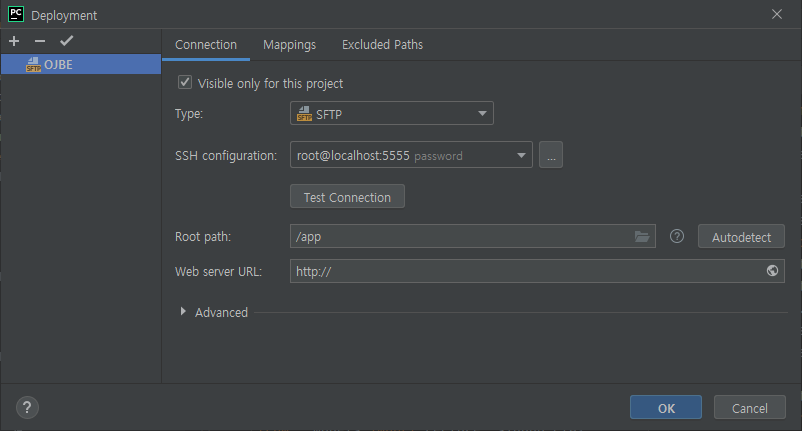

## 개요

## 최소 요구 사항 (Minimum requirements)

프로세서(CPU) : Intel(R) Core(TM) i5-750 CPU @ 2.66GHz

메모리(RAM) : 16GB (Linux, macOS(intel)의 경우 8GB)

## Windows 10


### Docker
Docker, Docker-compose 설치

WSL2 기반 Docker 설치
[Docker-desktop install](https://www.docker.com/products/docker-desktop)

Docker - Setting - General에서
Docker-Compose V2 옵션 적용


이후 아래 명령어를 통해 각 컨테이너 이미지 내려받기 & 컨테이너 compose up 진행

```bash
docker-compose -f docker-compose.yml up -d
# 개발 환경 구성의 경우 docker-compose -f docker-compose-develop.yml up -d
```


### Front-end
원격 개발 위한 Jetbrains Gateway 설치
[Jetbrains Gateway install](https://www.jetbrains.com/ko-kr/remote-development/gateway/)

이후 Remote Development - SSH에서 Connect to SSH (Connection : root@localhost:5556)


프로젝트 내 Github 로그인 진행 (Github page 내 Personal access tokens 사용 권장)


### Back-end
Pycharm 설치
[Pycharm install](https://www.jetbrains.com/ko-kr/pycharm/download/#section=windows)

터미널에서 아래 명령어 입력

```bash
git clone https://github.com/DCUSnSLab/DCU_Online_Judge_Backend.git
```

project open 후 Tools - Deployment - Configuration에서 Connection 진행 

(Type : SFTP, SSH Configuration : root@localhost:5555, Root path : /app)


이후 Tools - Deployment - Automatic upload 체크 권장 및 선택 사항

## Linux

Docker, Docker-compose 등 필요 소프트웨어 설치

```bash
sudo apt-get update && sudo apt-get install -y vim python-pip curl git
pip install docker-compose
```

Docker 설치
```bash
sudo curl -sSL get.docker.com | sh
```

## 설치 과정

터미널에서 아래 명령어 입력

```bash
git clone https://github.com/DCUSnSLab/DCU-Online-Judge-Deploy.git
```

이후 해당 경로로 이동한 뒤 아래 명령어 입력


```bash
docker-compose -f docker-compose.yaml up -d
# 개발 환경 구성의 경우 docker-compose -f docker-compose-develop.yaml up -d
```

서비스 URL은 ```localhost:80``` 
초기 Admin 계정은 ```root```, 패스워드는 ```rootroot``` 입니다.

## pgadmin4

docker-compose 시 개발 환경 구성으로 셋업하는 경우,
데이터베이스 확인을 위한 pgadmin4 컨테이너를 포함하여 compose를 진행합니다.
pgadmin4 디폴트 계정 ID / PW는 아래와 같습니다.

admin@admin.com
root

# Forked by
https://github.com/QingdaoU/OnlineJudgeDeploy/tree/2.0
